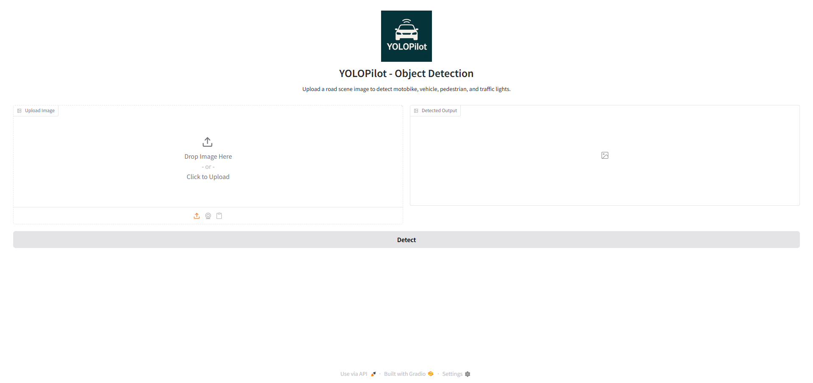

<p align="center">
  
</p>

# YOLOPilot 

YOLOPilot is a road-scene object detection system based on **YOLOv8**, designed to detect **motorbikes**, **pedestrians**, **vehicles**, and **traffic lights** in real-world traffic videos and images.

The project involves training on two datasets — one labeled manually and another extracted frame-by-frame from video. It explores **transfer learning** and **training from scratch**, compares multiple approaches (resizing vs. padding), and evaluates performance using confusion matrices and F1 curves.

## Features

- YOLOv8-based object detection
- Data preprocessing with label remapping and image handling
- Transfer learning with resizing and auto-padding
- Gradio-powered web application
- Docker-ready for deployment

---

## Getting Started

### Requirements

Install dependencies using pip:

```bash
pip install -r requirements.txt
```

Main libraries used:

- ultralytics

- gradio

- opencv-python

- Pillow

- pandas

- numpy


## Usage

### Preprocessing

Run the label converter and image splitter before training:

``` bash
python First_data_set/label_modify.py # Label correction of first dataset
python second_data_set/label_modify.py # Label correction of second dataset
python second_data_set/split.py # Images of second dataset must be split according to lables
python second_data_set/resize.py # Resizing images of second dataset and correct the lables to from 480x300 to 416x416 pixels
```


## Project Structure
```
YOLOPilot/
├── first_dataset/
│ ├── train
│ │ ├── images
│ │ ├── lables_old
│ │ └── lables
│ ├── valid
│ │ ├── images
│ │ ├── lables_old
│ │ └── lables
│ ├── test
│ │ ├── images
│ │ ├── lables_old
│ │ └── lables
│ ├──label_modify.py
│ └── runs → Results after training
│ 
├── second_dataset/
│ ├── train(Resized), train_orginal
│ │ ├── images
│ │ └── lables
│ ├── val(Resized), val_orginal
│ │ ├── images
│ │ └── lables
│ ├── test(Resized), test_orginal
│ │ ├── images
│ │ └── lables
│ ├── labels_train.csv, labels_val.csv
│ ├── new_labels
│ ├── images_resized
│ ├── resized_labels
│ ├──label_modify.py
│ ├──resize.py
│ ├──split.py
│ └── runs → Results after training
│
├── docs/
│ ├── images/
│ │ ├── logo.png
│ │ └── app_screenshot.png
│
├── PostProcessing_box.py
├── train_total.py
├── valid_total.py
├── Dockerfile
├── requirements.txt
├── yolopilot_app.py
├── Dockerfile
└── README.md
```

## Train the Model

For training from scratch on either the first or second dataset, run:

```bash
python train_total.py
```

The script will use the model architecture specified by the model_arch variable (e.g. "yolov8s.pt" for YOLOv8-small).

To apply transfer learning, change the model_arch in train_yolov8.py to point to the best weights of the first dataset:

```bash
model_arch = "first_dataset/runs/dataset1_yolov8_imgsz416_epoch50/weights/best.pt"
```
Make sure you also adjust the data YAML and project output names accordingly when switching between datasets.

## Run the App
Start the Gradio app locally:

```bash
python yolopilot.py
```

### Application Screenshot

<p align="center">
  
</p>
